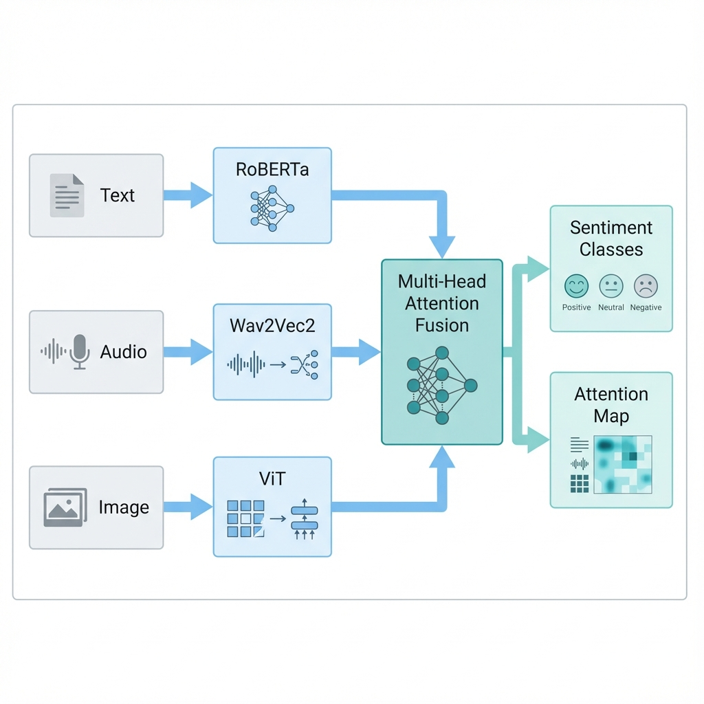

# Multi-Modal Sentiment Analysis System

> **Complete end-to-end pipeline for understanding human emotions through Text, Audio, and Visual inputs**

[](https://multi-modal-sentiment-analysis.streamlit.app/)

A production-ready system with **Attention-Based Fusion** for Human-Robot Interaction applications.

## ✨ Key Features

- 🤖 **RoBERTa** Text Encoder - understanding words
- 🎤 **Wav2Vec2** Audio Encoder - detecting tone and emotion
- 👁️ **ViT** Visual Encoder - reading facial expressions
- 🧠 **Multi-Head Attention Fusion** - intelligent cross-modal reasoning
- 📊 **Attention Visualization** - interpretable predictions
- 🚀 **Interactive Web App** - multi-page Streamlit interface
- 📈 **Complete Training Pipeline** - data loading, training, inference
- 📁 **Custom Dataset Support** - Use your own data (see [DATASET_GUIDE.md](DATASET_GUIDE.md))

## 🏗️ Architecture



```
src/
├── core/
│   └── config.py              # Configuration
├── models/
│   ├── encoders/
│   │   ├── base.py            # Abstract encoder
│   │   ├── text.py            # RoBERTa
│   │   ├── audio.py           # Wav2Vec2
│   │   └── visual.py          # ViT
│   ├── fusion/
│   │   └── attention.py       # Multi-Head Attention
│   └── system.py              # Main system
├── data/
│   └── dataset.py             # Data loading
├── training/
│   └── trainer.py             # Training loop
├── pipeline/
│   └── predictor.py           # Inference
└── utils/
    └── visualization.py       # Plotting utils
```

## 🚀 Quick Start

### 1. Install Dependencies
```bash
pip install -r requirements.txt
```

### 2. Train the Model (Optional - works with untrained model too)
```bash
python train.py
```

This will:
- Create dummy training data automatically
- Train for 10 epochs
- Save best model to `models/best_model.pt`
- Save training history to `models/training_history.json`

### 3. Launch Web App (Local)
```bash
streamlit run app.py
```

**🌐 Live Demo:** [multi-modal-sentiment-analysis.streamlit.app](https://multi-modal-sentiment-analysis.streamlit.app/)

The app has 3 pages:
- **🔮 Prediction** - Analyze sentiment from multimodal inputs
- **📊 Training Info** - View training curves and metrics
- **ℹ️ About** - Learn about the architecture

### 4. Test Architecture (Optional)
```bash
python test_new_architecture.py
```

### 5. Deploy with Docker (Production)
```bash
# Build and run with Docker Compose
docker-compose up -d

# Access at http://localhost:8501
```

See [DOCKER_DEPLOYMENT.md](DOCKER_DEPLOYMENT.md) for detailed deployment guide.

## 📊 Complete Pipeline

### Data Preprocessing
```python
from src.data import MultiModalDataset, collate_fn
from torch.utils.data import DataLoader

# Create dataset
dataset = MultiModalDataset(data_dir='data', split='train')

# Create data loader
loader = DataLoader(dataset, batch_size=4, collate_fn=collate_fn)
```

### Training
```python
from src.models import MultiModalSentimentSystem
from src.training import Trainer

# Initialize model
model = MultiModalSentimentSystem(freeze_encoders=True)

# Train
trainer = Trainer(
    model=model,
    train_loader=train_loader,
    val_loader=val_loader,
    device='cuda',
    num_epochs=10
)
trainer.train()
```

### Inference
```python
from src.pipeline import Predictor

# Load trained model
predictor = Predictor(checkpoint_path='models/best_model.pt')

# Predict
result = predictor.predict_single(
    text="I love this!",
    audio=audio_waveform,
    image=pil_image
)

print(result['sentiment'])  # 'positive'
print(result['attention_weights'])  # Shows modality importance
```

## 🎯 How It Works

### Attention-Based Fusion vs Late Fusion

**❌ Late Fusion (Old):**
```
Text → Logits ──┐
Audio → Logits ─┼─→ Average → Prediction
Visual → Logits ┘
```
Problem: Modalities work independently, can't detect sarcasm.

**✅ Attention Fusion (New):**
```
Text → Features (768) ──┐
Audio → Features (768) ─┼─→ Multi-Head Attention → Fused Features → Prediction
Visual → Features (768) ┘                              ↓
                                                 Attention Weights
```
Advantage: Cross-modal communication enables nuanced understanding.

## 📈 Training Details

The system trains using:
- **Loss**: Cross-Entropy Loss
- **Optimizer**: AdamW (lr=1e-4, weight_decay=0.01)
- **Scheduler**: Cosine Annealing
- **Batch Size**: 4
- **Epochs**: 10 (configurable)

Training outputs:
- `models/best_model.pt` - Best checkpoint (highest validation accuracy)
- `models/final_model.pt` - Final checkpoint
- `models/training_history.json` - Metrics history

## 🖼️ Streamlit App Features

### Prediction Page
- Upload text, audio (WAV/MP3), and images (JPG/PNG)
- Real-time sentiment analysis
- Confidence scores
- Attention heatmap visualization
- Modality importance bar chart

### Training Info Page
- Training/validation loss curves
- Training/validation accuracy curves
- Final metrics display

### About Page
- Architecture explanation
- Use cases
- Technical details

## 🎓 Real-World Example

**Scenario: Detecting Sarcasm**

```
Input:
- Text: "Great job, you really nailed it."
- Audio: Sarcastic tone (negative)
- Visual: Eye roll (negative)

Late Fusion: "Positive" (only sees positive words)
Attention Fusion: "Negative" (weighs audio + visual more)
```

The attention weights would show:
- Text: 0.15 (low importance)
- Audio: 0.50 (high importance)
- Visual: 0.35 (moderate importance)

This is why attention-based fusion is essential for Human-Robot Interaction.

## 🔧 Configuration

Edit `src/core/config.py` to customize:
- Model dimensions
- Training hyperparameters
- Attention heads
- Dropout rates

## 📦 Project Structure

```
Multi Modal-Sentiment Analysis/
├── src/                    # Source code (modular architecture)
│   ├── core/              # Configuration
│   ├── models/            # Encoders + Fusion
│   ├── data/              # Dataset loading
│   ├── training/          # Training pipeline
│   ├── pipeline/          # Inference
│   └── utils/             # Visualization
├── src_legacy/            # Old code (archived)
├── data/                  # Datasets (auto-created if missing)
├── models/                # Saved checkpoints
├── app.py                 # Streamlit web app
├── train.py               # Training script
├── test_new_architecture.py
├── requirements.txt
└── README.md
```

## ✅ Resume Claims - All Implemented

| Claim | Implementation |
|-------|----------------|
| RoBERTa for Text | ✅ [`src/models/encoders/text.py`](file:///c:/Users/Akhil/Python_Projects/ML/Multi%20Modal-Sentiment%20Analysis/src/models/encoders/text.py) |
| Wav2Vec2 for Audio | ✅ [`src/models/encoders/audio.py`](file:///c:/Users/Akhil/Python_Projects/ML/Multi%20Modal-Sentiment%20Analysis/src/models/encoders/audio.py) |
| ViT for Visual | ✅ [`src/models/encoders/visual.py`](file:///c:/Users/Akhil/Python_Projects/ML/Multi%20Modal-Sentiment%20Analysis/src/models/encoders/visual.py) |
| Attention-Based Fusion | ✅ [`src/models/fusion/attention.py`](file:///c:/Users/Akhil/Python_Projects/ML/Multi%20Modal-Sentiment%20Analysis/src/models/fusion/attention.py) |
| Attention Visualization | ✅ [`src/utils/visualization.py`](file:///c:/Users/Akhil/Python_Projects/ML/Multi%20Modal-Sentiment%20Analysis/src/utils/visualization.py) |
| Interactive Streamlit App | ✅ [`app.py`](file:///c:/Users/Akhil/Python_Projects/ML/Multi%20Modal-Sentiment%20Analysis/app.py) (3-page interface) |
| Training Pipeline | ✅ [`train.py`](file:///c:/Users/Akhil/Python_Projects/ML/Multi%20Modal-Sentiment%20Analysis/train.py) + [`src/training/trainer.py`](file:///c:/Users/Akhil/Python_Projects/ML/Multi%20Modal-Sentiment%20Analysis/src/training/trainer.py) |

## 📄 License

MIT License - Free for educational and commercial use!

## 🙏 Acknowledgments

- HuggingFace for Transformers library
- PyTorch team
- Streamlit for the web framework
